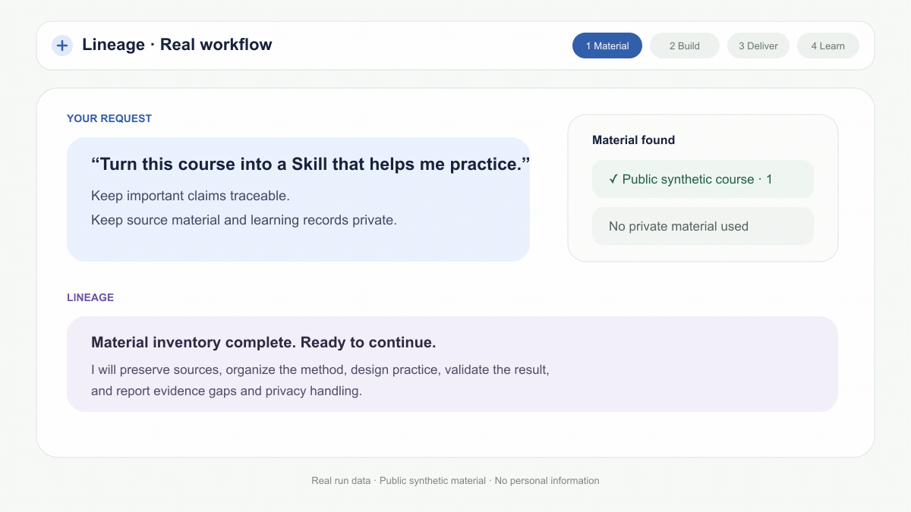

# Lineage Skill

**Turn courses, books, and handouts into a source-grounded learning Skill that helps you practice**

It does more than summarize. It teaches concepts through progressive micro-lessons and reliable terminal ASCII/SVG visuals, asks two end-of-lesson questions together, responds to each answer, and tests independent use in real situations.

[中文](./README.md) · [Installation](./docs/install.md) · [Changelog](./CHANGELOG.md)

## What it can do for you

A normal course summary tells you what the teacher said. Lineage Skill focuses on whether you can actually do the work:

1. Turn videos, audio, books, PDFs, handouts, and notes into a reusable learning Skill.
2. Keep a source trail for important claims so you can return to the original passage, quote, or key visual.
3. Organize what the teacher notices, how decisions are made, when a method applies, and how results are checked.
4. Arrange practice in a sensible order instead of doing the decisive work for you.
5. Preserve your attempts, mistakes, revisions, and real-world results so you can gradually form your own method.

The goal is not permanent dependence on an AI tutor. It is independent performance on real problems without prompts or templates.

## The complete user journey

You do not need to run project scripts or understand the internal file structure. The complete path is: install Lineage, give it your material, generate and enable a course Skill, and start learning.

| Step | What you do | What Lineage does |
| --- | --- | --- |
| 1. Install Lineage | Send the [installation guide](./docs/install.md) to your AI assistant and let it install the Skill; restart when prompted | Checks the runtime requirements and completes the installation without asking you to run commands |
| 2. Provide material | Upload files or point to the course folder, then describe what you ultimately want to be able to do | Inventories video, audio, documents, notes, and existing work so completed stages are not repeated |
| 3. Confirm the goal | Say whether you mainly want source lookup, systematic learning, help with real problems, or practical checklists and templates | Explains whether the material is sufficient, what is missing, how deep the result can go, and how raw material will be protected |
| 4. Let it build | Confirm that it should begin; you do not need to direct every stage | Handles transcription, recognition, source mapping, teacher-method extraction, practice design, and quality checks; interrupted work can resume |
| 5. Review and enable | Read the delivery summary and confirm that no important material was missed | Delivers the course Skill, reports coverage, evidence gaps, coaching depth, and privacy handling, then enables it in the current assistant |
| 6. Start the first lesson | Tell the new Skill your goal, current level, available time, and a real situation you care about | Runs a short baseline check, teaches one concept progressively with terminal ASCII or SVG when useful, then shows two questions together and evaluates each answer |
| 7. Keep learning | Return with “continue from last time” or submit real work | Preserves attempts, mistakes, and revisions, schedules review, and gradually reduces support |
| 8. Update or graduate | Add new material when it appears, or request an independent check when ready | Updates the course while preserving progress, then tests delayed recall and transfer before claiming mastery |

### A simulated legal learning case in 18 seconds

Follow a simulated contract-review case to see how Lineage turns a course method into practice, feedback, revision, and independent use. The example is educational and is not legal advice.

### A complete first request

> Use Lineage Skill to inspect this course material and turn it into a course Skill that can help me genuinely learn. My goal is to apply the course method in real work. Keep important claims traceable to their sources, and keep raw material and personal learning records private. First tell me what material you found and what is missing. If there is no risky decision for me to make, continue through organization, validation, and enabling the new Skill, then tell me how to begin the first lesson.

You do not need to learn role names or configuration choices. Describe what you ultimately want to be able to do, and Lineage will choose the suitable approach.

### What a complete delivery should include

A complete handoff clearly states:

- whether the new course Skill has been generated and is ready to use;
- which videos, documents, lessons, and notes were processed;
- whether important claims can be traced back to sources;
- which passages are weakly supported, unclear, or need human review;
- whether the result supports full coaching, guided learning, or source lookup only;
- where raw material and personal learning records are kept, and whether either entered the generated result;
- how to enable the new Skill and begin the first lesson.

If any of this is unclear, ask Lineage to complete the delivery check before starting the course.

### How to begin learning

> Start teaching me with the course Skill you just created. First ask about my goal, current level, weekly time, and one real application. After a short baseline check, teach one concept progressively and use terminal ASCII or SVG when it clarifies the idea; do not output Mermaid source. Then show both questions together, wait for my answers, and evaluate them separately.

On later visits, you do not need to repeat the full background. These short requests are enough:

| What you want | What to say |
| --- | --- |
| Continue learning | “Continue from last time and give me the single most useful exercise for today.” |
| Check the source | “Find the teacher's original position and source on this question. Do not start an exercise this time.” |
| Submit real work | “Here is work I produced with the course method. Evaluate it against the course criteria, then identify the single most important problem.” |
| Review | “Use my previous mistakes to schedule a review, but do not repeat the original question.” |
| Test transfer | “Use a situation I have not seen before to check whether I can apply the method independently.” |
| Solve a real problem | “Let me explain my judgment and plan first, then use the course method to correct the most important gap.” |
| Add new material | “Update the course Skill with these new lessons while preserving my existing learning progress.” |
| Prepare for an independent check | “Give me no hints. Test me in a new situation and explain what evidence of mastery is still missing.” |

Lineage chooses the smallest suitable workflow for the material you already have. It reuses existing transcripts and notes, and can transcribe or recognize video, audio, and scanned documents when the required services are available. If something essential is unavailable, it explains what is missing and what can still be completed.

## Supported materials

| What you have | What Lineage does |
| --- | --- |
| Course videos | Combines speech, slides, whiteboards, demonstrations, and other visual teaching evidence |
| Recordings or podcasts | Produces searchable text organized by lesson and topic |
| PDFs, scanned handouts, and ebooks | Recognizes the body text, structure, tables, and important pages |
| Markdown, text files, chapters, and notes | Keeps source locations while extracting methods, cases, and practice |
| Existing transcripts or course notes | Reuses completed work instead of processing the same material again |
| Multiple courses or teachers | Preserves each position, condition, and disagreement instead of forcing one answer |

The material does not have to be perfect. Lineage identifies missing evidence, uncertain passages, and items that need human review rather than presenting guesses as the teacher's original view.

## From understanding to independent ability

| Stage | What you gain |
| --- | --- |
| Traceable sources | Important claims link back to the original passage, quote, handout, or key visual |
| The teacher's working method | Learn what to notice, how to judge, when a method applies, and when it does not |
| Ability through practice | Move from imitation and correction to independent work across different situations |
| A personal method | Turn real attempts, failures, and outcomes into reusable personal experience |

A typical journey is: clarify the goal, study a demonstration, imitate, receive correction, work independently, transfer the method to a changed situation, pass a final check, and continue with long-term review.

## How it coaches

- Source questions are answered directly with evidence and are not counted as proof of mastery.
- New concepts move from intuition to precise definition, visual model, example, counterexample, and a three-point recap.
- Visuals default to terminal-safe ASCII, with real SVG files for more complex relationships; raw Mermaid is not emitted when rendering is uncertain.
- Each concept uses two formative questions: understanding first and application second. Both are shown together, then evaluated separately.
- Baseline checks, retrieval, transfer, and independent assessment remain attempt-first so answers are not leaked.
- Each round of feedback focuses on the most important current problem and gives only the hint needed for revision.
- Your first attempt, revision, and reason for changing are preserved.
- Delayed review, parallel tasks, and changed constraints test whether the ability lasts and transfers.
- Templates and hints gradually fade as you improve.
- Mastery requires unaided work, success after a delay, performance in a new context, and recognition of boundaries.

## What you receive

- A course-backed Skill for ongoing conversation and learning.
- A traceable organization of the course knowledge and working methods.
- A sensible learning path with practical exercises.
- Feedback on concrete attempts, revision guidance, and review suggestions.
- Clear statements about material completeness, evidence strength, and capability boundaries.
- A personal method proposal only after enough practice, and only with your approval.

When the material is rich enough, Lineage can support full coaching. When it supports explanation but not reliable practice or assessment, the Skill clearly falls back to source lookup or guided learning instead of pretending to be a complete mentor.

## Privacy, provenance, and boundaries

- Raw courses, transcripts, screenshots, scanned content, and personal learning records are not published by default.
- Attempts, mistakes, review plans, and real-world results stay separate from the course Skill; regenerating the Skill does not delete them.
- A repeatedly tested method is proposed as a durable personal method only after your explicit approval.
- Teacher source, source-grounded synthesis, AI inference, and your real-world evidence remain visibly distinct.
- Disagreements between teachers retain their own sources and conditions instead of being turned into false consensus.
- Lineage never claims to clone a teacher's personality, consciousness, or complete experience.
- Medical, legal, financial, investment, and other high-risk material remains educational and source-bounded. It does not replace professional qualification or responsibility.
- Use only material you are authorized to process and respect its copyright and distribution limits.

## License

Licensed under [PolyForm Noncommercial License 1.0.0](./LICENSE). For commercial use or collaboration, contact <juneyaooo@gmail.com>.
