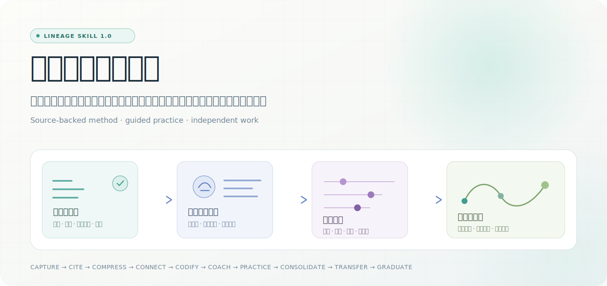
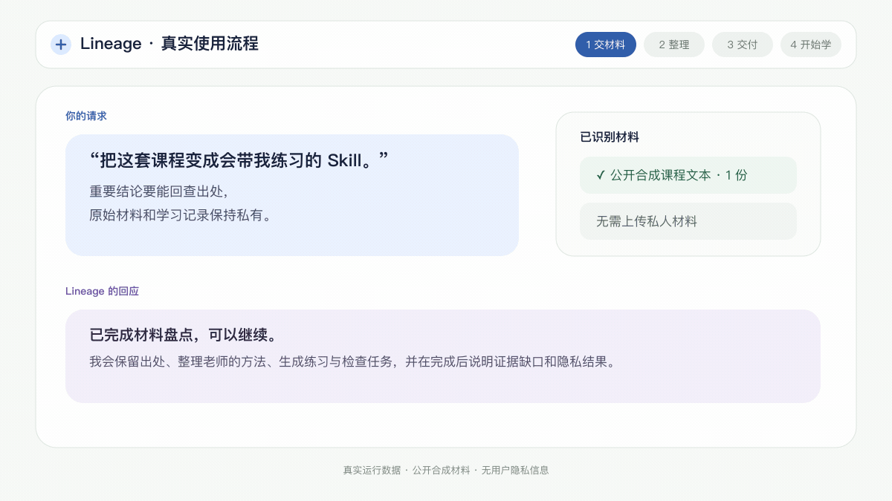
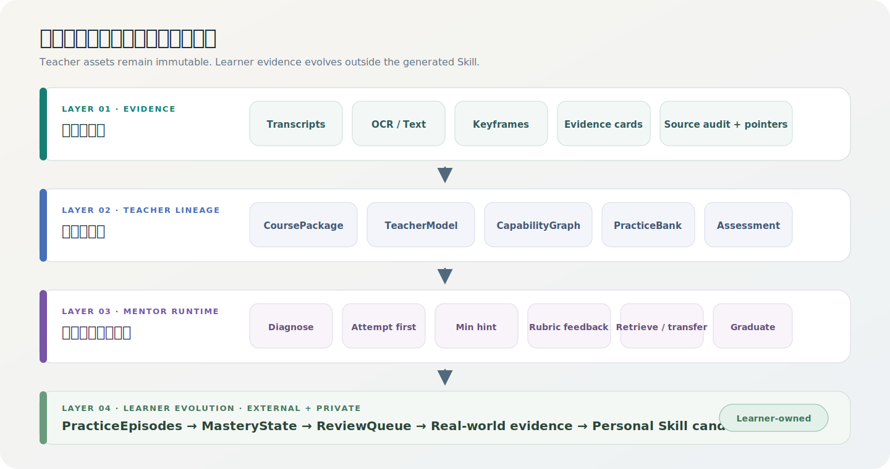
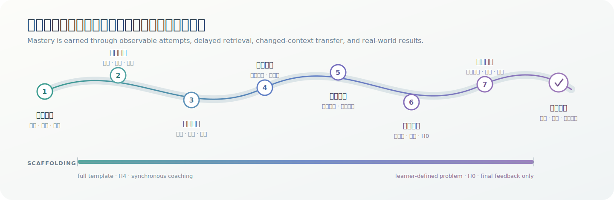
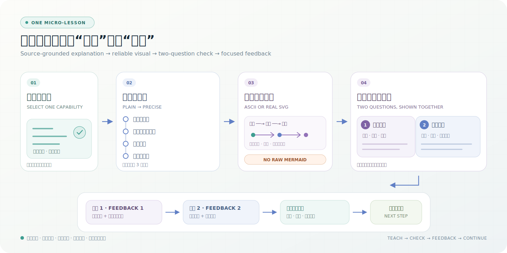

# Lineage Skill

**把课程、书籍和讲义，变成一个有出处、会带你练习的专属学习 Skill**

它不只总结内容，还会用深入浅出的微课和必要的 ASCII/SVG 图示讲清知识点，逐题检查理解，针对你的回答给反馈，并检查你能不能在真实场景中独立使用。

[English](./README.en.md) · [安装说明](./docs/install.md) · [更新记录](./CHANGELOG.md)

## 它能帮你做什么

普通课程摘要只能告诉你“老师讲了什么”。Lineage Skill 更关心你最后能不能真正做出来：

1. 把视频、音频、书籍、PDF、讲义和笔记整理成可持续使用的学习 Skill。
2. 为重要结论保留出处，让你随时回查原文、原话或关键画面。
3. 提炼老师观察问题、作出判断、选择方法和检查结果的过程。
4. 根据学习顺序安排练习，不会一开始就把完整答案替你做掉。
5. 保存你的尝试、错误、修订和现实结果，帮助你逐渐形成自己的方法。

最终目标不是让你永久依赖 AI 导师，而是让你能离开提示，独立解决真实问题。

## 完整使用流程

你不需要运行项目脚本，也不需要理解内部文件结构。完整路径就是：安装 Lineage、交给它材料、生成并启用课程 Skill，然后直接开始学习。

| 步骤 | 你要做什么 | Lineage 会做什么 |
| --- | --- | --- |
| 1. 安装 Lineage | 把[安装说明](./docs/install.md)发给你的 AI 助手，让它代你安装；安装后按提示重启助手 | 检查运行条件并完成安装，不要求你手动执行命令 |
| 2. 交给它材料 | 上传文件，或告诉它课程材料所在的文件夹；再说清楚你最后想学会什么 | 盘点视频、音频、文档、笔记和已有整理结果，避免重复处理 |
| 3. 确认目标 | 说明你主要想查资料、系统学习、解决真实问题，还是产出清单和模板 | 告诉你材料是否够用、缺少什么、能做到哪种深度，以及原始材料会怎样保护 |
| 4. 自动整理 | 确认开始；之后不需要逐步指挥 | 完成转录、识别、出处整理、老师方法提炼、练习设计和质量检查；中断后可以继续 |
| 5. 验收并启用 | 查看交付说明，确认没有遗漏重要材料 | 交付课程 Skill，说明来源覆盖、证据缺口、可带教程度和隐私处理，并把它启用到当前助手 |
| 6. 开始第一课 | 告诉新 Skill 你的目标、基础、可投入时间和想解决的真实问题 | 先做简短摸底，再逐步讲清一个知识点，必要时用终端图或 SVG；讲完一起给出两道题，回答后分别点评 |
| 7. 持续学习 | 每次回来只要说“继续上次进度”，也可以提交真实作品 | 保存尝试、错误和修订，安排复习，并逐渐减少提示 |
| 8. 更新或出师 | 有新材料就交给它更新；准备好时要求做一次独立检验 | 更新课程内容但保留学习进度；通过延迟复习和新场景检验后，再判断是否真正掌握 |

### 18 秒看懂：一个模拟法律学习案例

通过一个模拟合同审查案例，看看 Lineage 如何把课程方法变成练习、反馈、修订和独立应用。案例仅用于学习演示，不构成法律意见。

### 第一次可以直接这样说

> 请使用 Lineage Skill 检查这套课程材料，并把它整理成一个能带我真正学会的课程 Skill。我的目标是把课程方法用到真实工作中。重要结论要能回查出处，原始材料和个人学习记录保持私有。请先告诉我识别到了哪些材料、还缺什么；如果没有需要我决定的风险，就继续完成整理、检查并启用新 Skill，最后告诉我怎样开始第一课。

如果你不知道该选择哪种学习方式，不需要研究任何角色名称，直接说“我最终想做到什么”即可，Lineage 会据此选择合适方式。

### 交付时应该看到什么

一次完整交付会明确告诉你：

- 新课程 Skill 是否已经生成并可以使用；
- 哪些视频、文档、章节和笔记已经处理；
- 重要结论能否回查出处；
- 哪些内容证据不足、识别不清或需要人工确认；
- 当前可以完整带教、只能引导学习，还是只适合资料查询；
- 原始材料和个人学习记录保存在哪里、是否进入了生成结果；
- 下一步如何启用新 Skill 并开始第一课。

如果这些信息没有交代清楚，可以直接让 Lineage 补做交付检查，不要在结果不明时开始学习。

### 生成后怎么开始学习

> 用刚刚生成的课程 Skill 开始带我学习。先问清楚我的目标、基础、每周可投入时间和一个真实应用场景；做一次简短摸底后，从一个知识点开始深入浅出地讲，必要时用终端 ASCII 图或 SVG 图示，不要输出 Mermaid 源码。讲完一起给我两道题，等我回答后分别点评。

之后每次回来，不需要重复介绍全部背景。下面这些说法就足够：

| 你想做什么 | 可以直接说 |
| --- | --- |
| 继续学习 | “继续上次进度，给我今天最应该做的一项练习。” |
| 查老师原意 | “帮我查老师对这个问题的原意和出处，这次不用安排练习。” |
| 提交真实作品 | “这是我按课程方法完成的作品，先按课程标准评价，再指出最关键的一个问题。” |
| 复习巩固 | “根据我以前的错误安排一次复习，不要重复原题。” |
| 检查迁移 | “换一个我没见过的场景，检查我能不能独立使用这个方法。” |
| 解决现实问题 | “先让我说明自己的判断和方案，再用课程方法帮我纠偏。” |
| 追加新材料 | “把这些新章节更新进课程 Skill，保留我原来的学习进度。” |
| 准备独立检验 | “不要给提示，用新场景检查我是否真的掌握，并说明还缺什么证据。” |

Lineage 会根据材料现状选择合适的处理方式。已有文字稿或整理结果时会直接复用；面对视频、音频或扫描资料时，会在可用服务支持下完成转录和识别。如果缺少必要条件，它会明确告诉你缺什么，以及当前还能做到哪一步。

## 支持哪些材料

| 你已有的材料 | Lineage 会做什么 |
| --- | --- |
| 课程视频 | 结合讲解声音、画面、幻灯片、板书和演示进行整理 |
| 录音或播客 | 转成可检索文字，并按章节和主题组织 |
| PDF、扫描讲义、电子书 | 识别正文、结构、表格和重要页面 |
| Markdown、TXT、章节和笔记 | 保留原文位置，提炼方法、案例和练习 |
| 已有文字稿或课程整理 | 跳过重复处理，在已有成果上继续完善 |
| 多门课程或多位老师的材料 | 保留各自观点、条件和分歧，不强行拼成一个答案 |

材料可以不完整。Lineage 会标出缺失证据、模糊内容和需要人工确认的地方，不会把推测冒充老师原意。

## 从“看懂”到“会做”

| 阶段 | 你得到什么 |
| --- | --- |
| 找得到出处 | 重要结论可以回查原文、原话、讲义或关键画面 |
| 看懂老师的方法 | 不只记结论，还能理解老师先看什么、怎么判断、何时不用某种方法 |
| 通过练习掌握 | 从模仿、纠错到独立完成，在不同情境中反复验证 |
| 形成自己的方法 | 用真实尝试、失败和结果沉淀可复用的个人经验 |

典型学习过程是：明确目标、观看示范、尝试模仿、接受纠偏、独立实战、换场景应用、完成检验，再进入长期复习和精进。

## 它会怎样带你练

- 查资料时直接回答并附上出处，不会把一次查询算成“已经掌握”。
- 学习新知识时先建立直觉，再给准确定义、图示、例子、反例和三点小结。
- 图示默认使用各终端都能显示的 ASCII，复杂关系生成真实 SVG；不直接输出可能无法渲染的 Mermaid 源码。
- 每个知识点默认一起给出两道形成性问题：第一题检查理解，第二题检查应用；回答后按题号分别点评。
- 摸底、复习、迁移和独立检验仍然要求你先提交判断、解释、方案或作品，避免答案泄露。
- 每轮反馈只抓最关键的问题，给刚好够用的提示。
- 要求你根据反馈修订，并保留第一次尝试和修改原因。
- 用延迟复习、相似题和变化条件的新场景检查是否真的掌握。
- 随着能力提高逐步减少模板和提示，直到你可以独立完成。
- 只有当你隔一段时间仍然会做、换场景也能用并知道边界时，才认为真正学会。

## 你会得到什么

- 一个可以持续对话和学习的课程 Skill。
- 一套能回查出处的课程知识与方法整理。
- 符合先后顺序的学习路线和练习任务。
- 针对具体尝试的反馈、修订建议和复习安排。
- 对材料完整度、证据强弱和能力边界的明确说明。
- 在充分实践后，由你决定是否沉淀的个人方法。

材料足够丰富时，Lineage 可以进行完整带教；材料只够解释概念时，它会诚实地退回到资料查询或引导学习，不会假装已经具备完整导师能力。

## 隐私、来源与边界

- 原始课程、转录、截图、扫描内容和个人学习记录默认不会作为公开内容发布。
- 个人尝试、错误、复习安排和现实结果与课程 Skill 分开保存，重新生成 Skill 不会删除这些记录。
- 只有你明确同意后，系统才会把经过多次实践验证的方法建议为个人长期方法。
- 老师原意、基于材料的整理、AI 的推断和你自己的现实证据会明确区分。
- 多位老师意见冲突时会保留各自出处与适用条件，不制造虚假的统一结论。
- 它不会声称复制老师的人格、意识或全部经验。
- 医学、法律、金融、投资等高风险内容仅用于有来源的教育和学习，不能替代专业资质或现实责任。
- 请只处理你有权使用的材料，并遵守课程版权和分发限制。

## 致谢

- [Datawhale](https://github.com/datawhalechina) — AI 教育、开源课程与学习者社区实践。
- [rfeng1016](https://github.com/rfeng1016) — 对渐进知识组织方向的建议。
- [LINUX DO](https://linux.do/) — 中文开发者社区的讨论与反馈。

## License

本项目采用 [Apache License 2.0](./LICENSE)。
